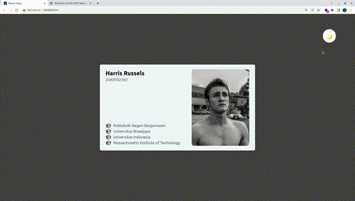

## Navbar Follow Section when Scrolling 

[🌐 Live](https://afifabroory.github.io/prototyping/AlpineJS/section-scroll-navbar-things/)

- Alpine JS
- Tailwind CSS

## Student Card
I learn:
- Hooks:
    - State
    - Context
- Light and Dark mode using the hooks
- Props
- Components

[🌐 Live](https://afifabroory.github.io/prototyping/ReactJS/student-card/build/)